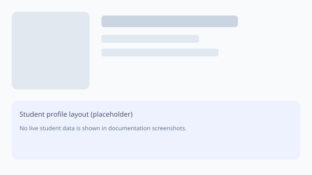

# Viewing a student

Opening a student profile shows the information your role is allowed to see for the active school.

## Steps

1. Navigate to **Students** from the main menu.
2. Locate the student using search or filters.
3. Open the student row to load the profile.

## What you may see

Common sections include:

- Personal details and identifiers
- Current enrolment / class
- Guardian links
- Notes and history available to your role

School Manager only shows actions you are authorised to perform. If an action is missing, it is usually a permission or school-context restriction rather than a documentation gap.

## Screenshots

The illustration below is a generic layout reference (no live student data):

## Related

- [Students overview](overview)
